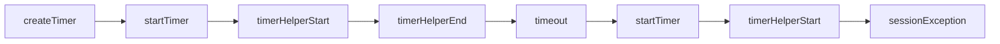

# Bugs found with Julay

Julay’s `spec` → TLA+ path is meant to catch real protocol bugs, not only toy examples. This page collects concrete cases where a short spec, a compile to TLC, and an invariant violation led to a fix in production code (including the standard library).

## Timer: restart vs session-constructor rebind

**Component:** [`julay.proclib.Timer`](../../src/main/resources/stdlib/julay/proclib/Timer.jul) — part of the [standard library](../language/standard-library.md) (shipped with `julayc`; `import julay.proclib.Timer`).

### Claim

Prove that Timer never throws a session-constructor rebind `JulayException`. In generated TLA+, that property is `SessionIntegrity == ~sessionException`, emitted automatically when a session constructor is present (here: `timerHelperStart`).

### Finding the bug

The stdlib source already declares a finite multi-instance spec:

```jul
sort Ctrl := {"c1", "c2", "c3"}
sort Help := {"h1", "h2", "h3"}
spec TimerSpec := TimerController[c : Ctrl] || TimerHelper[h : Help]
```

1. Compile the spec (from a directory where you want the artifacts):

```bash
java -jar julayc.jar path/to/Timer.jul --compile TimerSpec
```

2. Run TLC on `TimerSpec.tla` / `TimerSpec.cfg`.

TLC reported `SessionIntegrity` violated **within seconds** — breadth-first search hit a shallow counterexample; no long exploration was required.

### What the counterexample means

Focus on one controller (`c1`) and one helper slot (`h1`):



1. **`createTimer`** — Controller `c1` is constructed.
2. **`startTimer`** — Client asks for a delay (`start` becomes true).
3. **`timerHelperStart`** — First rendezvous succeeds: session `c1↔h1` opens, helper `h1` is constructed, timing begins. No exception.
4. **`timerHelperEnd`** — Delay finishes: helper is marked done, `ringTimeout` is set, but **session affinity stayed live**.
5. **`timeout`** — Controller clears timing / ring flags. Affinity to `h1` still live.
6. **`startTimer` again** — Second start.
7. **`timerHelperStart` again** — Tries to construct another helper while `c1` still has affinity to `h1`. `CanStartSession` fails → `sessionException' = TRUE`.

Cancel was already safe (`killSessionPeer` clears the helper session). The happy path — fire, timeout, start again — was not.

**In practice this race was rare.** After `timerHelperEnd`, `TimerHelper` usually had no enabled actions and exited on its own, scrubbing affinity before the next `startTimer` / `timerHelperStart`. Only under irregular scheduling (helper exit delayed relative to the controller’s restart) would the rebind exception surface. TLC still found that interleaving because the model does not assume eager helper cleanup.

### Fix

Eager teardown on the success path, with an explicit peer class name:

- On `timerHelperEnd` (controller): `after: exitSession(TimerHelper)`
- On `cancelTimer`: `after: killSessionPeer(TimerHelper)`

Named peer arguments make teardown unambiguous when the controller also holds a session with a client.

After the fix, re-running TLC on `TimerSpec` finds no `SessionIntegrity` violation.

### See also

- Current source: [`Timer.jul`](../../src/main/resources/stdlib/julay/proclib/Timer.jul)
- [Sessions](../language/sessions.md)
- [Sessions in TLA+](../language/specifications.md#sessions-in-tla) (`SessionIntegrity`, `sessionException`)
- [Standard library](../language/standard-library.md)
