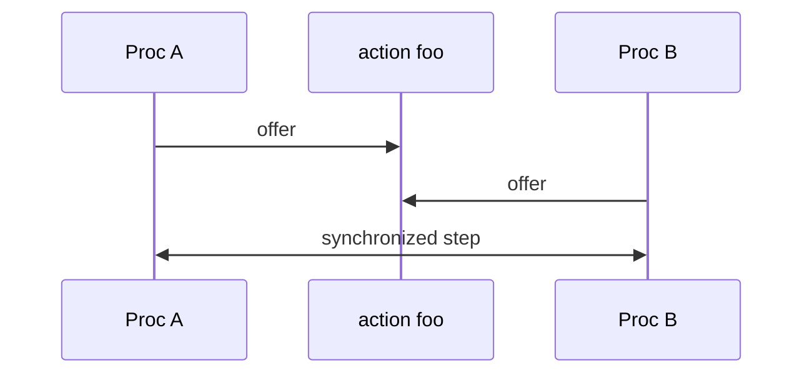

# Julay language guide

**Julay is a verification-aware language for building distributed systems correctly.**

From the same source you can build an executable system and, where you write a `spec`, emit TLA+ for model checking with TLC.

## Execution model

A Julay **program is a sequence of actions**.

- Procs may **construct** upon an action or **transition** upon an action (subject to synchronization with peers; transitions may also use guards—constructors cannot).
- Every program **begins with the `initially` action**. After that, execution continues through **user-defined** actions—transitions and any further constructors used when spawning.

## Mental model

- A **proc** is a transition system with local state (`var` / `const`).
- Parallel composition (`||`) runs procs together.
- Peers coordinate by **synchronizing on a shared action** (not shared memory). When they sync, arguments are exchanged **by copy**, never by reference. Parallel composition itself is **occurrence-based** (`A || A` is two occurrences); see [Composition and actions](composition-and-actions.md).

## Philosophy

- Processes **do not share resources**.
- A process may act as an **interface** to a resource: other procs synchronize with it to use that resource.
- Synced objects (action arguments) are always **by copy, not by reference**.

Two different instances of the **same proc class never synchronize** with each other on ordinary or `internal` actions. Only distinct classes can pair. Details: [Composition and actions](composition-and-actions.md).

## `compile`

Top-level `compile Name, ...` selects what `julayc` emits:

- **Proc** names → runnable JARs (error if the assembly reaches a sort-bearing type)
- **Spec** names (composition or leaf) → `.tla` / `.cfg` (sorts and sort-field objs allowed)

How-to: [Getting started](../getting-started.md). Specs: [Specifications](specifications.md).

## Chapters

1. [Processes](processes.md) — state, `initially`, constructors vs transitions
2. [Composition and actions](composition-and-actions.md) — `||`, **apis**, modifiers, synchronization
3. [Compiler optimizations](compiler-optimizations.md) — sync fast paths (`eq-unify`, …), `--disable-opt`, and TLA+ `--disable-tla-opt` (`unused-fields`, `unused-vars`, `determined-args`, `from-collection`, `literal-domains`, `unwrap-singletons`)
4. [Types and expressions](types-and-expressions.md)
5. [Collections](collections.md) — `List` / `Map` / `Set`, methods, lambdas
6. [Procfuns](procfun.md) — process-backed blocking calls
7. [Modules](modules.md) — `import` and search path
8. [Sessions](sessions.md) — sticky pairwise protocols
9. [Side effects](effects.md) — library procs vs funlib functions; `before` / `after` / transit IO
10. [Standard library](standard-library.md) — proclib and funlib (including which have effects)
11. [Creating libraries](creating-libraries.md) — authoring `.jul` and Kotlin-native libs
12. [Specifications](specifications.md) — invariants, specs, TLC
13. [Reference](reference.md) — keywords, operators, builtins

## Examples

Worked demos: [Examples](../examples/README.md).
