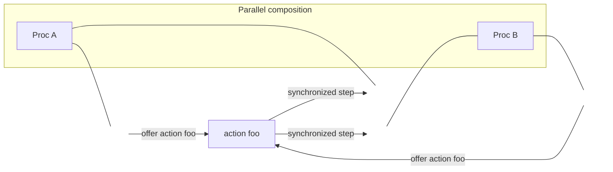

# Julay language guide

**Julay is a verification-aware language for building distributed systems correctly.**

From the same source you can build an executable system and, where you write a `spec`, emit TLA+ for model checking with TLC.

## Execution model

A Julay **program is a sequence of actions**.

- Procs may **construct** upon an action or **transition** upon an action (subject to guards and synchronization with peers).
- Every program **begins with the `initially` action**. After that, execution continues through **user-defined** actions—transitions and any further constructors used when spawning.

## Mental model

- A **proc** is a transition system with local state (`var` / `const`).
- Parallel composition (`||`) runs procs together.
- Peers coordinate by **synchronizing on a shared action** (not shared memory). When they sync, arguments are exchanged **by copy**, never by reference.

## Philosophy

- Processes **do not share resources**.
- A process may act as an **interface** to a resource: other procs synchronize with it to use that resource.
- Synced objects (action arguments) are always **by copy, not by reference**.

Two different instances of the **same proc class never synchronize** with each other on ordinary or `internal` actions. Only distinct classes can pair. Details: [Composition and actions](composition-and-actions.md).

## `compile`

Top-level `compile Name, ...` selects what `julayc` emits:

- **Proc** names → runnable JARs
- **Spec** names → `.tla` / `.cfg`

How-to: [Getting started](../getting-started.md). Specs: [Specifications](specifications.md).

## Chapters

1. [Processes](processes.md) — state, `initially`, constructors vs transitions
2. [Composition and actions](composition-and-actions.md) — `||`, modifiers, synchronization
3. [Types and expressions](types-and-expressions.md)
4. [Modules](modules.md) — `import` and search path
5. [Sessions](sessions.md) — sticky pairwise protocols
6. [Effects](effects.md) — side effects after a step
7. [Standard library](standard-library.md)
8. [Specifications](specifications.md) — invariants, specs, TLC
9. [Reference](reference.md) — keywords, operators, builtins

## Examples

Worked demos: [Examples](../examples/README.md).
