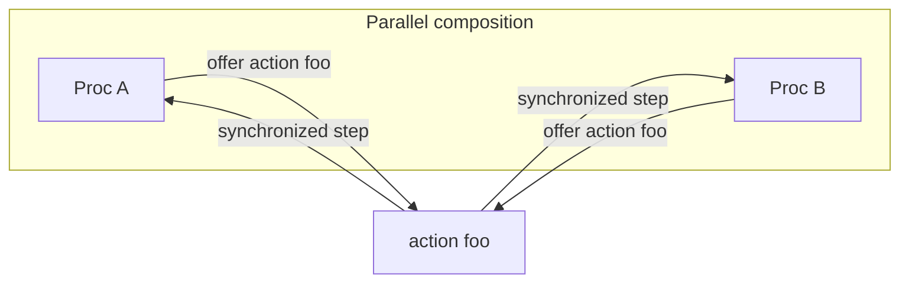

# Composition and actions

## Parallel composition

Compose procs with `||`:

```jul
proc IncServer := Counter || Printer || ServerLogic
```

Each component keeps its own state. They interact only by **synchronizing on shared actions**.

`||` is **occurrence-based** and **left-associative**: each mention of a proc class is a separate occurrence (`A || A` is two occurrences of `A`, not one). Do not confuse this with exchanging action arguments **by copy** (no shared references).

When both sides of a binary `||` offer the same **non-service** action (ordinary or `session`) with a matching signature, they sync and that action becomes **internal to the composition** — it is not part of the outer alphabet. Unilateral actions and `service` actions remain visible on the assembly. Source-tagged `internal` actions never leave their declaring proc and may reuse names freely.

```jul
proc X := A || B    // A,B sync on y → y internal to X (private channel)
proc Z := C || D    // C,D sync on y → y internal to Z (different private channel)
proc W := X || Z
```

In `W`, **A does not sync with C or D on `y`**, and **B does not sync with C or D on `y`**. Same surface name, distinct hidden events.

The same scoping applies to duplicated classes under different partners:

```jul
proc P := (A || X) || (B || X)   // or: Left := A||X; Right := B||X; P := Left || Right
```

Here the two occurrences of `X` sync with `A` and `B` respectively on a shared action `w`; those events stay private to each pair. Tooling: `julayc analyze --tree` lists each occurrence; `--actions-detail --include-internal` shows composition-hidden offers with distinct `scope=…` channel keys (not collapsed by class name).

### Alphabet integrity (JAR and TLA+)

These checks apply to the **compile/spec target** (same rules for JAR and TLA+):

- If two or more occurrences of the same class still expose the same ordinary/session action `w` in the **external** alphabet, that is an error — unless the target also includes a single `service` provider for `w` (duplicate consumers are allowed). So `compile P` for a dangling `w` on two `X`s fails, but `compile Q` for `Q := P || S` with `service` `w` on `S` can succeed.
- At most one `service` provider per action name (`X || Y` where both declare `service` `w` is an error).

JAR `compile` targets may not leave unsynced non-service actions in their external alphabet (tag them `internal` if a solo step is intentional). `service` actions are exempt. Specs may still use unilateral assume/system actions.

### TLA+ occurrence names

When emitting TLA+, a unique leaf class keeps its name. If class `X` appears more than once, every occurrence is renamed using the introducing assembly: `proc P := A || X` and `proc Q := B || X` composed together become `X_P` and `X_Q`. Same-parent ties (`proc P := X || X`) use `X_P_1`, `X_P_2`, …. Renamed state variables get `(* ... *)` comments. Julay invariants still write `X.n`; the compiler expands them per occurrence in TLA+.

## Synchronization (language level)

When two (or more, for some roles) procs offer the **same action** with compatible arguments and guards, they take a **synchronized step** together.



Important consequences of Julay’s philosophy:

- Processes **do not share resources**; a proc may **interface** a resource for others.
- Action arguments are exchanged **by copy**, never by reference—no shared mutable objects across procs.

### Same class never syncs

**Two different occurrences of the same proc class never synchronize with each other** on ordinary (default) or `internal` actions. Only **distinct proc classes** can pair on a shared action.

`service` actions pair a **provider** with **consumers** (clients)—not two equal peers of the same class collaborating as duplicates of each other.

## Action modifiers

| Modifier | Role |
|----------|------|
| *(none)* | Ordinary rendezvous between complementary peers |
| `internal` | Local / solo-style step (no cross-class pairing of the ordinary kind) |
| `service` | Multiplexed API: one provider, many potential clients |
| `session` | Sticky pairwise protocol—see [Sessions](sessions.md) |

`session` is incompatible with `service` and `internal`. All offers of an action must agree on the modifier.

Examples:

```jul
service transition increment() { ... }   // API on Counter
internal transition println(msg : String) { ... }
session transition createHttpServer(port : Int) { ... }
```

## Offering the same action

For ordinary sync, different classes declare the same action name. For example, `IncReqHandler` transitions on `increment` while `Counter` offers `service transition increment()`—they synchronize so the handler bumps the counter through Counter’s interface ([inc server](../examples/inc-server.md)).

## See also

- [Processes](processes.md)
- [Sessions](sessions.md)
- [Creating libraries](creating-libraries.md)
- [Philosophy in the language overview](README.md)
