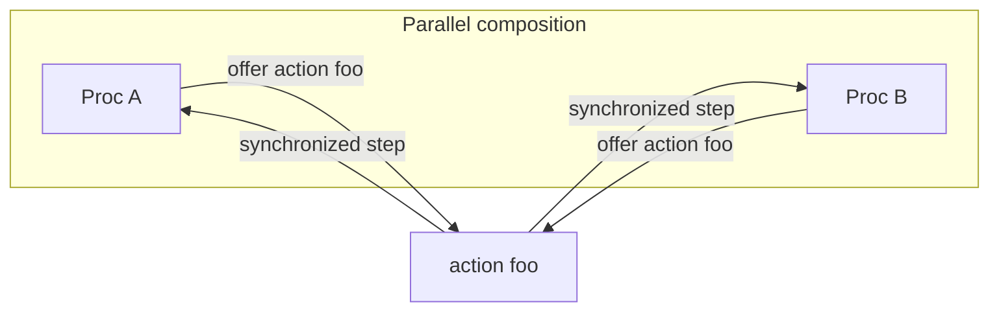

# Composition and actions

## Parallel composition

Compose procs with `||`:

```jul
proc IncServer := Counter || Printer || ServerLogic
```

Each component keeps its own state. They interact only by **synchronizing on shared actions**.

`||` is **occurrence-based** and **left-associative**: each mention of a proc class is a separate occurrence (`A || A` is two occurrences of `A`, not one). Do not confuse this with exchanging action arguments **by copy** (no shared references).

When both sides of a binary `||` offer the same **ordinary** (untagged) or `session` action with a matching signature, they sync and that action becomes **internal to the composition** — it is not part of the outer alphabet. Unilateral actions and unmatched `client` actions remain visible on the assembly. A `provider` stays external after meeting clients (further clients can still sync with it); those clients leave the external alphabet. Source-tagged `internal` actions never leave their declaring proc and may reuse names freely.

```jul
proc X := A || B    // A,B sync on y → y internal to X (private channel)
proc Z := C || D    // C,D sync on y → y internal to Z (different private channel)
proc W := X || Z
```

In `W`, **A does not sync with C or D on `y`**, and **B does not sync with C or D on `y`**. Same surface name, distinct hidden events.

The same scoping applies to duplicated classes under different partners:

```jul
proc P := (A || X) || (B || X)   // or: Left := A||X; Right := B||X; P := Left || Right
```

Here the two occurrences of `X` sync with `A` and `B` respectively on a shared action `w`; those events stay private to each pair. Tooling: `julayc analyze --tree` lists each occurrence; `--actions-detail --include-internal` shows composition-hidden offers with distinct `scope=…` channel keys (not collapsed by class name).

### Provider / client (local compose rules)

| Offers on `w` | Behavior |
|---------------|----------|
| ordinary / ordinary | sync → composition-hide |
| `client` / `client` | do **not** hide; both stay external |
| `client` / `provider` | provider stays external; clients leave the external alphabet |
| ordinary / `provider` or ordinary / `client` | **compile error** |
| `provider` / `provider` | **compile error** (at most one provider) |

`client` is an explicit opt-in: two clients never pairwise-hide with each other, so they can wait for a `provider` that appears later in the composition tree. Ordinary peers that already hid `w` inside a library stay sealed — `(A || B) || P || C` still compiles when `A`/`B` are ordinary and `P`/`C` are provider/client.

Same-class ordinary offers never sync: when two occurrences of class `X` both expose untagged `w` at a compose step (e.g. `(A || X) || (B || X)` with no peer syncing on `w`), that is a **compose-time** error. A later `provider` cannot redeem those offers (ordinary + provider is also illegal).

### Alphabet integrity (JAR and TLA+)

These checks apply to the **compile/spec target** (same rules for JAR and TLA+):

- External `client` of `w` with no `provider` `w` → error.
- At most one `provider` per action name.

JAR `compile` targets **warn** (but still succeed) when unsynced ordinary or session actions remain in their external alphabet — those offers simply never enable at runtime. Tag them `internal` if a solo step is intentional. Specs may still use unilateral assume/system actions.

### TLA+ occurrence names

When emitting TLA+, a unique leaf class keeps its name. If class `X` appears more than once, every occurrence is renamed using the introducing assembly: `proc P := A || X` and `proc Q := B || X` composed together become `X_P` and `X_Q`. Same-parent ties (`proc P := X || X`) use `X_P_1`, `X_P_2`, …. Renamed state variables get `(* ... *)` comments. Julay invariants still write `X.n`; the compiler expands them per occurrence in TLA+.

## Synchronization (language level)

When two (or more, for some roles) procs offer the **same action** with compatible arguments and guards, they take a **synchronized step** together.



Important consequences of Julay’s philosophy:

- Processes **do not share resources**; a proc may **interface** a resource for others.
- Action arguments are exchanged **by copy**, never by reference—no shared mutable objects across procs.

### Same class never syncs

**Two different occurrences of the same proc class never synchronize with each other** on ordinary (default) or `internal` actions. Only **distinct proc classes** can pair on a shared action.

`provider` / `client` actions pair one hub with many clients—not two equal peers of the same class collaborating as duplicates of each other.

## Action modifiers

| Modifier | Role |
|----------|------|
| *(none)* | Ordinary rendezvous between complementary peers |
| `internal` | Local / solo-style step (no cross-class pairing of the ordinary kind) |
| `provider` | One hub for an action name; syncs with `client`s |
| `client` | Only syncs with a `provider` of the same name (never with other clients) |
| `session` | Sticky pairwise protocol—see [Sessions](sessions.md) |

`session` is incompatible with `provider`, `client`, and `internal`. If two classes share any session action, they must not also share an ordinary (untagged) action; ordinary sync or `provider`/`client` with a *different* peer class is fine (examples in [Sessions](sessions.md)).

Examples:

```jul
provider transition increment() { ... }   // API on Counter
client transition increment() { ... }     // handler uses Counter
internal transition println(msg : String) { ... }
session transition createHttpServer(port : Int) { ... }
```

## Offering the same action

For ordinary sync, different classes declare the same action name. For a shared API, the hub uses `provider` and callers use `client`. For example, `IncReqHandler` offers `client transition increment()` while `Counter` offers `provider transition increment()` ([inc server](../examples/inc-server.md)).

## See also

- [Processes](processes.md)
- [Sessions](sessions.md)
- [Creating libraries](creating-libraries.md)
