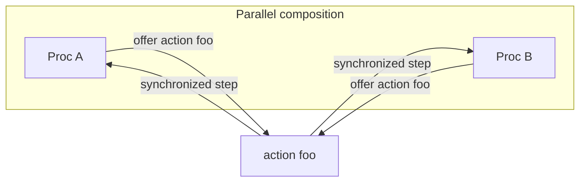

# Composition and actions

## Parallel composition

Compose procs with `||`:

```jul
proc IncServer := Counter || Printer || ServerLogic
```

Each component keeps its own state. They interact only by **synchronizing on shared actions**.

## Synchronization (language level)

When two (or more, for some roles) procs offer the **same action** with compatible arguments and guards, they take a **synchronized step** together.



Important consequences of Julay’s philosophy:

- Processes **do not share resources**; a proc may **interface** a resource for others.
- Action arguments are exchanged **by copy**, never by reference—no shared mutable objects across procs.

### Same class never syncs

**Two different instances of the same proc class never synchronize with each other** on ordinary (default) or `internal` actions. Only **distinct proc classes** can pair on a shared action.

`service` actions pair a **provider** with **consumers** (clients)—not two equal peers of the same class collaborating as duplicates of each other.

## Action modifiers

| Modifier | Role |
|----------|------|
| *(none)* | Ordinary rendezvous between complementary peers |
| `internal` | Local / solo-style step (no cross-class pairing of the ordinary kind) |
| `service` | Multiplexed API: one provider, many potential clients |
| `session` | Sticky pairwise protocol—see [Sessions](sessions.md) |

`session` is incompatible with `service` and `internal`. All offers of an action must agree on the modifier.

Examples:

```jul
service transition increment() { ... }   // API on Counter
internal transition println(msg : String) { ... }
session transition createHttpServer(port : Int) { ... }
```

## Offering the same action

For ordinary sync, different classes declare the same action name. For example, `IncReqHandler` transitions on `increment` while `Counter` offers `service transition increment()`—they synchronize so the handler bumps the counter through Counter’s interface ([inc server](../examples/inc-server.md)).

## See also

- [Processes](processes.md)
- [Sessions](sessions.md)
- [Philosophy in the language overview](README.md)
