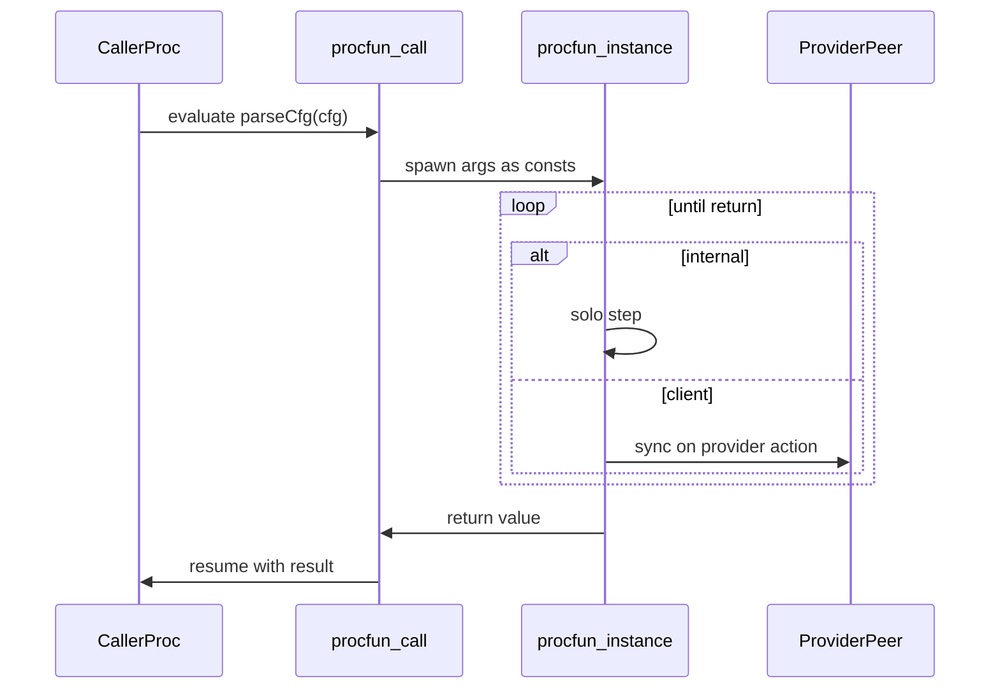

# Procfuns

A **procfun** is a process-backed blocking call: it looks like a function at the call site, but runs as a short-lived process with local state and transitions until an untagged `return:` yields a value to the caller.

It is **not** the same as:

| Construct | Role |
|-----------|------|
| Pure `fun` | Expression-inlined helper (no state, no steps) |
| `proc` | Peer in `\|\|` composition with a long-lived alphabet |

## Spawn-and-await

Evaluating a procfun call suspends the caller's current action evaluation, runs a fresh instance until a `return:` fires, then resumes with the returned value. While the instance is live it can take `internal` steps alone and `client` steps with `provider` peers in the surrounding program.



## Syntax

```jul
procfun parseCfg(cfg : String) : Set<Node> {
    var rawLines : List<String> := split(readFile(cfg), "\n")
    var idx : Int := 0
    var clusterBuilder : Set<Node> := {}

    internal transition parseAndBuildCluster() {
        guard: idx < length(rawLines)
        transit:
            // update clusterBuilder / idx …
            idx := idx + 1
    }

    transition endParse() {
        guard: idx = length(rawLines)
        return: clusterBuilder
    }
}
```

### Rules

| Rule | Detail |
|------|--------|
| Args | Each parameter is an implicit `const`, in scope for inits, guards, transit, and return. Do not redeclare it as `var`/`const`. |
| Inline init | `var x : T := expr` / `const c : T := expr` is allowed. Init may use args and earlier inline-inited names. |
| Init XOR | A state name is initialized **either** inline **or** in the procfun's single optional constructor — never both. Every state var must be initialized exactly once. |
| Step modifiers | Non-return transitions **must** be tagged `internal` or `client`. Untagged, `provider`, and `session` are errors. |
| Return | Untagged `transition … { return: expr }`. Mutually exclusive with `transit:` / `error:`. Expression must match the declared return type. Taking it terminates the instance and delivers the value. Multiple return transitions are allowed. |
| Call sites | Only in **transit RHS** (like value-returning effectful funlib). Not in guards or pure `fun` bodies. Nested procfun calls are OK. |
| Composition | **Call-only.** A procfun must not appear in `\|\|`, as a `compile` JAR/spec target, or as a `spec` leaf. |
| Recursion | Direct/mutual recursion among procfuns is rejected (loop with `internal` transitions instead). |

### Why return is untagged

`return:` is a completion edge that kills the instance and yields to the caller — not a SyncChannel rendezvous. Tagging it `internal` or `client` would be misleading.

## Caller example

```jul
proc RaftNodeMain {
    const self : Node
    const cluster : Set<Node>
    const listenPort : Int

    constructor initially(args : List<String>) {
        transit:
            let id : Int := parseInt(args[1])
            let cfg : CfgPair := parseCfg(args[0], id)
            self := cfg.me
            cluster := cfg.cluster
            listenPort := portFromUrl(cfg.me.url)
    }
}
```

Transit statement `let`s share one binding across several assigns (see [Side effects](effects.md#transit-statement-let)). Expression `let` remains available inside a single RHS when you only need a local binder there.

Keep `constructor initially` (not `transition initially`).

## Client steps inside a procfun

A running procfun may consume a provider API while the caller is blocked:

```jul
procfun fetchAndInc() : Int {
    var n : Int := 0

    client transition getCounter(counterVal : Int) {
        guard: true
        transit: n := counterVal
    }

    transition done() {
        return: n + 1
    }
}
```

`client` actions must be satisfiable by a `provider` in the compile/spec target (same alphabet rules as ordinary procs).

## Illegal examples

```jul
// ERROR: bare transition (must be internal or client)
transition step() { transit: i := i + 1 }

// ERROR: modifier on return
internal transition done() { return: i }

// ERROR: return + transit together
transition done() {
    return: i
    transit: i := 0
}

// ERROR: procfun in composition
proc Bad := parseCfg || Main

// ERROR: compile a procfun as a target
compile parseCfg
```

## Inline init vs constructor

```jul
procfun ok(x : Int) : Int {
    var a : Int := x + 1          // inline
    var b : Int                   // constructor
    constructor __user() {
        transit: b := 0
    }
    // … (runtime merges user ctor into the call)
    transition done() { return: a + b }
}
```

```jul
// ERROR: double init
var a : Int := 0
constructor c() { transit: a := 1 }
```

## TLA+ / verification

When a spec reaches a procfun call:

1. **Per-call-site occurrences** — each textual call is a distinct leaf (like `A || A`). Occurrences do not sync with each other on `internal` steps.
2. **Parent index inheritance** — if the enclosing leaf is indexed, e.g. `RaftNodeMain[i : NodeId]`, that call's procfun occurrence is indexed with the same binder `i`.
3. **Spawn-and-await split** — a parent action whose transit assigns a whole-RHS procfun call (e.g. `out := countUp(2)`) becomes two TLA actions: `<action>_invoke` starts the child and sets `<Host>_blocking`, then after `return:` sets `returnTo_<action>`, the resume `<action>` writes the inlined return value and clears blocking.
4. **`terminated`** — boolean state (indexed when the occurrence is). Init `FALSE`. Every `return:` sets `terminated' = TRUE`. Further child steps require `~terminated`.
5. **Liveness property** — the compiler emits `GF(P) == <>[]P` and:

```tla
ParseCfgTerminates == GF(terminated)
```

or, when indexed:

```tla
ParseCfgTerminates == \A i \in NodeId : GF(terminated[i])
```

Property name is `<OccurrenceTlaName>Terminates` (occurrence-qualified when the same procfun is called more than once). Use TLC to prove the helper finishes.

### Example: `countUp` → TLA+

Runtime spawn-and-await is modeled in TLA by blocking the caller while the procfun occurrence runs:

```jul
procfun countUp(n : Int) : Int {
    var i : Int := 0
    var result : Int := 0

    internal transition step() {
        guard: i < n
        transit:
            result := i + 1
            i := i + 1
    }

    transition done() {
        guard: i = n
        return: result
    }
}

proc Main {
    var out : Int

    constructor initially(args : List<String>) {
        transit:
            out := countUp(2)
    }
}

spec CountUpSpec := Main
```

Schematic TLA (variable names may be occurrence-prefixed when they would clash):

```tla
\* initially invokes the procfun countUp before executing
initially_invoke ==
  /\ ~Main_constructed
  /\ ~Main_blocking
  /\ invoke_countUp' = TRUE
  /\ Main_blocking' = TRUE   \* so Main does not execute other actions in the meantime
  /\ countUp_constructed' = TRUE
  /\ countUp_n' = 2
  /\ i' = 0
  /\ result' = 0
  /\ UNCHANGED <<out, countUp_terminated, returnTo_initially, Main_constructed>>

\* countUp steps (step / done) go here — done sets terminated' and returnTo_initially'

\* The guards for initially appear in initially_invoke
initially ==
  /\ returnTo_initially
  /\ Main_blocking
  /\ out' = result
  /\ Main_constructed' = TRUE
  /\ Main_blocking' = FALSE
  /\ returnTo_initially' = FALSE
  /\ UNCHANGED <<countUp_constructed, countUp_terminated, countUp_n, i, result, invoke_countUp>>

countUpTerminates == GF(countUp_terminated)
```

## See also

- [Processes](processes.md)
- [Composition and actions](composition-and-actions.md)
- [Side effects](effects.md)
- [Specifications](specifications.md)
- [Types and expressions](types-and-expressions.md) — pure `fun`
