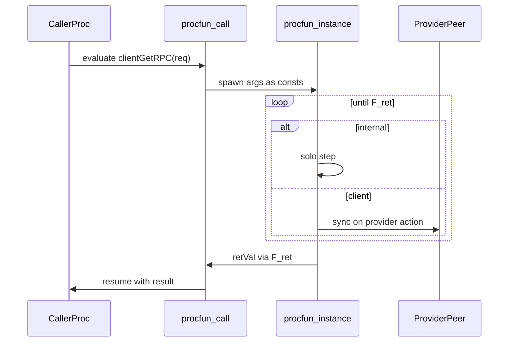

# Procfuns

A **procfun** is a process-backed blocking call: it looks like a function at the call site, but desugars to a short-lived process with local state and transitions until a synthetic return edge yields a value to the caller.

It is **not** the same as:

| Construct | Role |
|-----------|------|
| Pure `fun` | Expression-inlined helper (no state, no steps) |
| `proc` | Peer in `\|\|` composition, typically SyncChannel-started |

## Mental model: desugaring

A procfun is sugar over an ordinary proc shape. This is the most important way to read procfun code.

**Source:**

```jul
procfun clientGetRPC(req : HttpServerRequest) : HttpServerResponse {
    client transition getCommitted(stateMachine : List<String>) {
        return:
            HttpServerResponse {
                body := stateMachine + "",
                code := 200
            }
    }
}
```

**Desugars to (conceptual `proc`):**

```jul
proc clientGetRPC {
    const req : HttpServerRequest
    var retVal : HttpServerResponse          // TLA Init: retVal \in HttpServerResponse

    constructor clientGetRPC_call(req : HttpServerRequest) {
        transit:
            req := req
    }

    client transition getCommitted(stateMachine : List<String>) {
        transit:
            retVal := HttpServerResponse {
                body := stateMachine + "",
                code := 200
            }
    }

    transition clientGetRPC_ret(ret : HttpServerResponse) {
        guard:
            ret = retVal
    }
}
```

Rules of the desugar:

| Source | Becomes |
|--------|---------|
| Parameters | Implicit `const`s (plus bind in `F_call`) |
| `return: e` | `transit: retVal := e` (transition **modifier preserved**) |
| — | Synthetic `F_call` constructor (spawn entry) |
| — | Synthetic `F_ret` completion edge (`guard: ret = retVal`) |

At **runtime**, a call still feels like one logical return: the caller spawns the instance from the call site (not via a SyncChannel peer in `||`), blocks until completion, then resumes with the value. The synthetic `_ret` is the completion edge in the IR; the caller does not manually sync on it.

In the **VS Code** alphabet view, `F_call` and `F_ret` are hidden by default so the useful external surface (e.g. `getCommitted`) stays readable.

## Spawn-and-await

Evaluating a procfun call suspends the caller's current action, runs a fresh instance until `_ret` completes, then resumes with the returned value. While the instance is live it can take `internal` steps alone and `client` / ordinary / `session` steps with peers in the surrounding program.



## Syntax

```jul
procfun parseCfg(cfg : String) : Set<Node> {
    var rawLines : List<String> := split(readFile(cfg), "\n")
    var idx : Int := 0
    var clusterBuilder : Set<Node> := {}

    internal transition parseAndBuildCluster() {
        guard: idx < length(rawLines)
        transit:
            // update clusterBuilder / idx …
            idx := idx + 1
    }

    transition endParse() {
        guard: idx = length(rawLines)
        return: clusterBuilder
    }
}
```

### Rules

| Rule | Detail |
|------|--------|
| Args | Each parameter is an implicit `const`. Do not redeclare it as `var`/`const`. |
| Inline init | `var x : T := expr` / `const c : T := expr` is allowed. Init may use args and earlier inline-inited names. |
| Init XOR | A state name is initialized **either** inline **or** in the procfun's single optional constructor — never both. |
| Step modifiers | Any of bare / `internal` / `client` / `session`. **`provider` is forbidden.** |
| Reserved names | User transitions/ctors/vars cannot be named `initially`, `F_call`, `F_ret`, or `retVal`. |
| Return | `return: expr` on a transition (any allowed modifier). Mutually exclusive with `transit:` / `error:`. Desugars to `retVal := expr`. Bare (untagged) return edges become `internal` for sync so they can complete under spawn-and-await; `client` / `session` / `internal` tags are preserved. ≥1 return required. |
| Call sites | Only in **transit RHS** (like value-returning effectful funlib). Not in guards or pure `fun` bodies. |
| Recursion | Direct/mutual recursion among procfuns is rejected (loop with `internal` transitions instead). |

## Composition = spec / analyze metadata

Procfun instances are **spawned from the caller** and block until completion — they are **not** SyncChannel-started as peers just because they appear in `||`.

| Target | Behavior |
|--------|----------|
| JAR `Main` or `Main \|\| F` | Same runtime: calls still spawn-and-await. Composition does **not** start F as a SyncChannel peer. |
| Spec `Main` | Call sites to F **havoc** the result: one host step with `out' \in Ret`. **Warning** suggests adding `\|\| F`. |
| Spec `Main \|\| F` | Full coupling: host `act_call` / `act_ret` + child occurrence. |
| `compile F` / analyze F | Standalone helper TLA + alphabet. |

**Orphan:** `Foo || F` when Foo never calls F → **error**.

**Duplicate:** `Main || F || F` → **error**. Listing F once whitelists the helper; call-site multiplicity still comes from the call graph.

### Soundness of havoc

Havocing an uncomposed procfun is a **weaker** model than including it. A proof on the havoced spec still implies correctness of the refined (`|| F`) system. The converse may have false alarms (errors only under havoc). Prefer composing helpers you care about; the compiler warns when a call site would be havoced.

## Caller example

```jul
proc RaftNodeMain {
    const self : Node
    const cluster : Set<Node>
    const listenPort : Int

    constructor initially(args : List<String>) {
        transit:
            let id : Int := parseInt(args[1])
            let cfg : CfgPair := parseCfg(args[0], id)
            self := cfg.me
            cluster := cfg.cluster
            listenPort := portFromUrl(cfg.me.url)
    }
}

spec FullNode := RaftNodeMain || parseCfg
```

## Client steps with return

`return:` may sit on a `client` (or bare / `session` / `internal`) transition — no need for a separate untagged return step:

```jul
procfun fetchAndInc() : Int {
    var n : Int := 0

    client transition getCounter(counterVal : Int) {
        guard: true
        return: counterVal + 1
    }
}
```

## Illegal examples

```jul
// ERROR: provider forbidden
provider transition serve() { transit: x := 1 }

// ERROR: return + transit together
transition done() {
    return: i
    transit: i := 0
}

// ERROR: reserved name
transition initially() { return: 0 }

// ERROR: orphan composition
proc Bad := Other || parseCfg   // Other never calls parseCfg

// ERROR: duplicate listing
spec S := Main || countUp || countUp

// ERROR: compile a procfun as a JAR root is rejected; use compile for TLA/analyze only
// (procfuns are not SyncChannel-started top-level peers)
```

## Inline init vs constructor

```jul
procfun ok(x : Int) : Int {
    var a : Int := x + 1          // inline
    var b : Int                   // constructor
    constructor __user() {
        transit: b := 0
    }
    transition done() { return: a + b }
}
```

## TLA+ / verification

When a spec reaches a procfun call:

1. **Whitelist via `||`** — only procfuns listed in the composition are coupled; others havoc.
2. **Per-call-site occurrences** — each textual call is a distinct leaf when coupled.
3. **Parent index inheritance** — indexed hosts yield indexed occurrences.
4. **Spawn-and-await split** — host `act_call` starts the child and sets `Host_blocking`; after child `F_ret` sets `returnTo_act`, host `act_ret` writes `retVal` into the assign target and clears blocking.
5. **`terminated`** — boolean state; `F_ret` sets `terminated' = TRUE`. Further child steps require `~terminated`.
6. **Liveness** — `<Occ>Terminates == GF(terminated)` (universally quantified when indexed).

### Example: coupled `countUp`

```jul
procfun countUp(n : Int) : Int {
    var i : Int := 0
    var result : Int := 0

    internal transition step() {
        guard: i < n
        transit:
            result := i + 1
            i := i + 1
    }

    transition done() {
        guard: i = n
        return: result
    }
}

proc Main {
    var out : Int
    constructor initially(args : List<String>) {
        transit: out := countUp(2)
    }
}

spec CountUpSpec := Main || countUp
```

Schematic TLA:

```tla
\* initially calls the procfun countUp before executing
initially_call ==
  /\ ~Main_constructed
  /\ ~Main_blocking
  /\ call_countUp' = TRUE
  /\ Main_blocking' = TRUE
  /\ countUp_constructed' = TRUE
  /\ countUp_n' = 2
  /\ i' = 0
  /\ result' = 0
  /\ UNCHANGED <<out, countUp_terminated, returnTo_initially, Main_constructed, retVal>>

\* countUp steps (step / done / countUp_ret) — countUp_ret sets terminated' and returnTo_initially'

\* The guards for initially appear in initially_call
initially_ret ==
  /\ returnTo_initially
  /\ Main_blocking
  /\ out' = retVal
  /\ Main_constructed' = TRUE
  /\ Main_blocking' = FALSE
  /\ returnTo_initially' = FALSE
  /\ UNCHANGED <<countUp_constructed, countUp_terminated, countUp_n, i, result, call_countUp>>

countUpTerminates == GF(countUp_terminated)
```

### Example: havoc (uncomposed)

```jul
spec Coarse := Main   \* warning: countUp called but not composed
```

Host collapses to a single step, e.g. `out' \in Int` — no child vars, no blocking, no `Terminates` for that helper.

## See also

- [Processes](processes.md)
- [Composition and actions](composition-and-actions.md)
- [Side effects](effects.md)
- [Specifications](specifications.md)
- [Types and expressions](types-and-expressions.md) — pure `fun`
